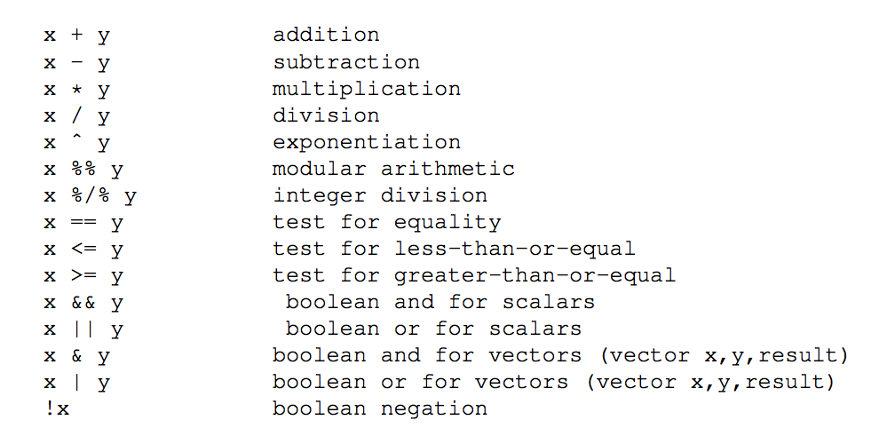

### chapter 2

+ _function call semantics_ 
    ```r
    oddcount <- function(x) {
        k <- 0 
        for(n in x){
            if (n %% 2 == 1) k <- k + 1
        }
        return(k)
    }
    ```
    + parameters are read-only, arguments are copied
    + if want to modify argument, use `return()`
+ _global variable_ 
    + modify with `<<-` superassignment
    ```r
    function() w <<- w + 1      # super assignment
    ```
+ _default arguments_ 
    ```r
    function(x, y = 2)
    ```
+ _data structures_ 
    + _vector_ 
    + _matrices_
        + a specialized vector with number of rows and number of columns added
        ```r
        m <- rbind(c(1,4), c(2,2))
        ```
        + `rbind`
    + _lists_ 
        + container of diverse data type, i.e. `struct`
        + used to package return value 
        + _member access_ with `$`
            + `x$u`
    + _data frame_
        + a list, with each component being a vector corresponding to a column 
+ _startup files_ 
    + `~/.Rprofile` 
+ _session data_ 
    + `.Rdata` saved workspace file
+ _regression analysis_ 
    ```r
    examsquiz <- read.table("file.txt", headers=F)
    class(examsquiz)  //  shows datatype
    head(examsquiz)   
    lma <- lm(examsquiz[,2] ~ examsquiz[,1])
    #v predicted_exam2 = beta_0 + beta_1 exam_1
    ```
    + `print.lm()` is a specialized function for prinrting `lm` class objects
    + `summary` prints more info


### chaper 3 Vectors

+ _scalar_ 
    + does not exists, objects are one-elment vectors
+ _vector_ 
    + _mode_ 
        + `integer`, `numeric` (floats), `character` (string), `logical`, complex, object
    + _indices_     
        + begin at 1
    + _impl_ 
        + stored contiguously 
        + cannot delete or insert items 
+ _array/matrix_ 
    + specialized vectors
+ _vector methods_ 
    + `legnth(v)`
+ _declaration_     
    + `y <- vector(length=2)`
+ _generate vector with `:` `seq` `rep`_ 
    ```r
    > 5:8
    [1] 5 6 7 8
    ```
    + `:`    
    ```r
    > seq(5,8)
    [1] 5 6 7 8
    > seq(12,30,3)
    [1] 12 15 18 21 24 27 30
    > seq(1.1,2,length=10)
    [1] 1.1 1.2 1.3 1.4 1.5 1.6 1.7 1.8 1.9 2.0
    ```
    + `seq()`
    ```r
    > x <- rep(8,4)
    [1] 8 8 8 8
    > rep(1:3,2)
    [1] 1 2 3 1 2 3
    ```
    + `rep(z, k)`
        + repeat funciton, put constant `z` into long vectors of length `k * length(z)`
+ _arithmetic and logical operation_    
    ```r
    > x <- c(1,2,4)
    > x + c(5,0,-1)
    [1] 6 2 3

    > x * c(5,0,-1) 
    [1] 5 0-4
    ```
    + _operation applied elementwise_
    ```r
    > x <- 1:10
    > if (any(x > 8)) print("yes")
    [1] "yes"
    > if (any(x > 88)) print("yes")
    > if (all(x > 88)) print("yes")
    > if (all(x > 0)) print("yes")
    [1] "yes"
    ```
    + `any` `all` logical operation over a vector
+ _recycling_ 
    + when applying operation to 2 vectors which require them to be of same length, the shorter one will be _recycled_ repeated until it is long enough
    ```r
    >x
    [,1] [,2]
    [1,]    1    4
    [2,]    2    5
    [3,]    3    6
    > x+c(1,2)
        [,1] [,2]
    [1,]    2    6
    [2,]    4    6
    [3,]    4    8
    ```
    + _note_ 
        + `x` is 3x2 matrix, but also a 6 element vector
        + R stores in column order
        + same as adding `c(1,2,1,2,1,2)` to `x`
+ _indexing_
    + `v[idx]` where `idx` is some vector
    ```r
    > y <- c(1.2,3.9,0.4,0.12)
    > y[c(1,3)]
    [1] 1.2 0.4
    > y[2:3]
    [1] 3.9 0.4
    ```
    ```r
    > x <- c(4,2,17,5) 
    > y <- x[c(1,1,3)] 
    > y
    [1] 4 417
    ```
    + _duplicates are allowed_
    ```r
    > z <- c(5,12,13)
    > z[-1]  # exclude element 1
    [1] 12 13
    > z[-1:-2]
    [1] 13
    ```
    + _negative subscripts means exclusion_ 
    ```r
    > z <- c(5,12,13) 
    > z[1:length(z)-1] 
    [1] 5 12
    ```
    + _use `:` as indices_ 
+ _element names_ 
    ```r
    > x <- c(1,2,4)
    > names(x)
    NULL
    > names(x) <- c("a","b","ab")
    > names(x)
    [1] "a" "b" "ab" >x
    a b ab 
    1 2 4
    ```
    + _assign names_
    ```r
    > names(x) <- NULL >x
    [1] 1 2 4
    ```
    + _remove names_
    ```r
    > x <- c(1,2,4)
    > names(x) <- c("a","b","ab")
    > x["b"]
    b 2
    ```
    + _reference vector element by name_
+ _elementwise operation on vector_ 
    + usually `f(vector)` can be thought of 
        + `(map f vector)`
    + _vectorized functions_ 
        ```r
        > u <- c(5,2,8) 
        > v <- c(1,3,9) 
        > u+v
        [1] 6 5 17 
        >u>v
        [1]  TRUE FALSE FALSE
        ```
        + _arithmetic and logical operations_
            + `+` (really a function over vector)
                + `'+'(1, 4)` gives 5
            + `>`
        ```r
        > sqrt(1:9)
        [1] 1.000000 1.414214 1.732051 2.000000 2.236068 2.449490 2.645751 2.828427
        [9] 3.000000
        ```
        + `sqrt`
        ```r
        > y <- c(1.2,3.9,0.4) 
        > z <- round(y)
        >z
        [1] 1 4 0
        ```
        + `round`
+ _filtering_ 
    + similar to functional language filtering 
    ```r
    > z <- c(5,2,-3,8) 
    > z*z > 8
    [1]  TRUE FALSE  TRUE  TRUE
    > z[c(TRUE,FALSE,TRUE,TRUE)]
    [1] 5 -3 8
    ```
    + _filter vector by a vector of `logical`_
    ```r
    > which(z*z > 8)
    [1] 1 3 4
    ```
    + _`which` returns index expression is true_
+ `ifelse`  
    + `ifelse(b,u,v) -> w`
        + `b` is boolean vector
        + `u` and `v` are vectors
        + returns a vector `w`, element `i` of which is `u[i]` if `b[i]` is true, or `v[i]` if `b[i]` is false
    ```r
    > x <- 1:10
    > y <- ifelse(x %% 2 == 0,5,12) 
    >y
    [1]12 5 12 5 12 5 12 5 12 5
    ```
    + produce a vector in which there is a 5 whenever `x` is even 12 otherwise
        + not `x %% 2 == 0` evaluated to `c(F,T,F,T,F,T,F,T,F,T)`
    + _advantage_ 
        + vectorized
        + potentially faster
    ```r
    > g <- c("M","F","F","I","M")
    > ifelse(g == "M",1,ifelse(g == "F",2,3))
    [1] 1 2 2 3 1
    ```
    + _nested `ifelse`_
        + inner call evaluated first
        + recoding to 3 possible values


### Chapter 4 Matrices 

+ _array_ 
    + multidimensional vectors
+ _matrices_ 
    + represent 2D array 
    + a vector with 2 additional attributes
        + number of rows 
        + number of columns
    + _property_ 
        + index begin from 1
        + _column-major order_
+ _general operation_   
    ```r
    > y <- matrix(c(1,2,3,4),nrow=2,ncol=2) >y
    [,1] [,2]
    [1,] 1    3
    [2,] 2    4
    ```
    + `matrix()` creates a matrix from vectors
    ```r
    > m <- matrix(c(1,2,3,4,5,6),nrow=3) 
    > m
        [,1] [,2]
    [1,]    1    4
    [2,]    2    5
    [3,]    3    6
    > m <- matrix(c(1,2,3,4,5,6),nrow=2,byrow=T) 
    >m
        [,1] [,2] [,3]
    [1,]    1    2    3
    [2,]    4    5    6
    ```
    + use `byrow=T` to specify row-major order
        + note dont have to specify `ncol` since can be inferred from vector and `nrow`
    + _notation_ 
        + `y[,2]` is column 2
    + _matrix operations_ 
        ```r
        > y %*% y  # ordinary matrix multiplication
        [,1] [,2]
        [1,] 7   15
        [2,]10   22
        > 3*y
        [,1] [,2]
        [1,] 3    9
        [2,] 6   12
        ```
+ _indexing_ 
    ```r
    >z
    [,1] [,2] [,3]
    [1,] 1
    [2,] 2
    [3,] 3
    [4,] 4
    > z[,c(2,3)]
    1 1 1 0 0 1 0 0
    [,1] [,2]
    [1,] 1    1
    [2,] 1    0
    [3,] 0    1
    [4,] 0    0
    ```
    + again, use `vector` as indices 
    ```r
    >y
    [,1] [,2]
    [1,] 1 4
    [2,] 2 5
    [3,] 3 6
    > y[2:3,] <- matrix(c(1,1,8,12),nrow=2) >y
        [,1] [,2]
    [1,]    1    4
    [2,]    1    8
    [3,]    1   12
    > x <- matrix(nrow=3,ncol=3)
    > x[2:3,2:3] <- cbind(4:5,2:3) >x
        [,1] [,2] [,3]
    [1,]   NA   NA   NA
    [2,]   NA    4    2
    [3,]   NA    5    3
    ```
    + _copy a smaller matrix into another matrix_
+ _row/column mean functions_   
    + `mean()` applies only to vectors not matrices
    + `rowMean()` `colMean()` returns vector containing means of rows and columns
+ _row/column names_
    ```r
    > z <- matrix(c(1,2,3,4),nrow=2) 
    >z
        [,1] [,2]
    [1,]    1    3
    [2,]    2    4
    > colnames(z)
    NULL
    > colnames(z) <- c("a","b") 
    >z
    a b
    ```
    + `colnames` and `rownames`
+ _dimension reduction_ 
    ```r
    > z <- matrix(1:8,nrow=4) 
    > z
        [,1] [,2]
    [1,]    1    5
    [2,]    2    6
    [3,]    3    7
    [4,]    4    8
    > r <- z[2,] 
    > r
    [1] 2 6
    > attributes(z)
    $dim
    [1] 4 2
    > attributes(r)
    NULL
    ```
    + _note_ 
        + `r` is a vector of length 2
        + may cause problems for doing matrix operations again
    ```r
    > r <- z[2,, drop=F] 
    >r
        [,1] [,2]
    [1,]    2    6
    > dim(r)
    [1] 1 2
    ```
    + _solution_ 
        + when subsetting, use `drop=F` to suppress implicit conversion from matrix to vector
        + or use `as.matrix()`
+ _adding/deleting elements of vectors and matrices_ 
    ```r
    > x <- c(12,5,13,16,8)
    > x <- c(x,20) # append 20
    >x
    [1]12 51316 820
    > x <- c(x[1:3],20,x[4:6]) # insert 20
    >x
    [1]12 5132016 820 #deleteelements2through4 > x <- x[-2:-4]
    >x
    [1]1216 820
    ```
    + _usually with indexing operator_
    ```r
    > one
    [1] 1 1 1 1 
    >z
    [,1] [,2] [,3]
    [1,] 1 1 1
    [2,] 2 1 0
    [3,] 3 0 1
    [4,] 4 0 0
    > cbind(one,z)
    [1,]1 1 1 1
    [2,]1 2 1 0
    [3,]1 3 0 1
    [4,]1 4 0 0
    ```
    + _`cbind` and `rbind`_
        + addes rows or columns to matrix 
        + or used to create matrices from vectors
+ `apply` 
    + used to apply a function to all rows or columns of a matrix 
    + `apply(z, dim, func)`
        + apply `func` to matrix `z` on its `dim`-th dimension 
            + `dim` is 1 stands for row, 2 for column
    ```r
    f <- function(x) x/c(2,8) 
    > y <- apply(z,1,f)
    > y
    [,1]  [,2] [,3]
    [1,]  0.5 1.000 1.50
    [2,]  0.5 0.625 0.75
    ```
+ `sapply()`
    + ...

+ _List_ 
    + like C struct
+ _creation_ 
    ```r
    j <- list()
    j <- list(name="joe", salary=55000)
    > j
    $name
    [1] "Joe"
    $salary
    [1] 55000
    ```
    ```r
    > jalt <- list("Joe", 55000, T)
    > jalt
    [[1]]
    [1] "Joe"
    [[2]]
    [1] 55000
    [[3]]
    [1] TRUE
    ```
+ _list tags_ 
    + names for list members are called _tags_
    + value associated with a tag is called its _value_
    ```r
    > names(j)
    [1] "name"   "salary" "union"
    ```
    + `names(list)`
        + returns tags
    ```r 
    > ulj <- unlist(j)
    > ulj
    name  salary   union
    "Joe" "55000"  "TRUE"
    > class(ulj)
    [1] "character"
    > x 
    $abc 
    [1] 2
    $de 
    [1] 5
    > ulx <- unlist(x)
    > ulx
    abc  de
    25
    > class(ulx) 
    [1] "numeric"
    ```
    + `unlist()`
        + returns values as a vector
        + return `mode` (type) depends on the least common denominator
        + _rule_ 
            + list elements are coerced to a common mode during unlisting 
            + vectors will be coerced to the highest type of the component in 
            + `NULL < raw < logical < integer < real < complex < character < list < expression`
+ _access list element_ 
    ```r
    >j
    $name
    [1] "Joe"
    $salary
    [1] 55000
    $union
    [1] TRUE

    > j[[1]]
    [1] "Joe"
    > j[2:3]
    $salary
    [1] 55000
    $union
    [1] TRUE
    ```
    + `$` used to desginate named elements of list 
    + `[[]]` 
        + references a single elemnt 
        + returns _value_ (vector..)
    + `[]` references a set of elements 
        + returns a sublist
+ _adding/deleting list elments_ 
    ```r
    list$new_tag <- new_value   # adds
    list$existing_tag] <- NULL  # delete
    ```
+ _indexing_ 
    ```r
    z[2:3]
    $c 
    [1] 1

    [[2]]
    [1] 1 2
    ```
    + with `[]` for ranges or slices 
    ```r
    function f() {return(list(mat=m, vec=v))}
    l <- f()
    m <- l$mat
    v <- l$vec
    ```
    + pack return value into lists
+ `lapply`
    + apply a function to all elements of a list
    ```r
    lapply(list(1:3, 25:27), median)
    [[1]]
    [1] 2

    [[2]]
    [1] 26
    ```
+ `length()` size of list 
+ _nested list_ 
    ```r
    > b <- list(u = 5, v = 12) > c <- list(w = 13)
    > a <- list(b,c)
    >a
    [[1]]
    [[1]]$u
    [1] 5
    [[1]]$v
    [1] 12
    [[2]]
    [[2]]$w
    [1] 13
    > length(a)
    [1] 2
    ```

### Chapter 6 data frame

+ _data frame_ 
    + like a matrix, except each column may have a different mode 
    + _is_ a list of equal-length vectors, each column is one element of the list   
    + _consequence_ 
        + use `$` to access column vectors
+ _matrix-like operation_ 
    + `rowMeans()` and `colMeans()`
    + `rbind()` and `cbind()`
        + `cbind` can be used to add new columns
            + `cbind(df, df$foo - df$bar)`
+ _indexing/filter `apply`_
    + `apply` works by coercing dataframe to matrices
+ _creating data frame_ 
    ```r
    > z <- data.frame(cbind(c(1,2),c(3,4))) 
    >z
      X1 X2 
    1 1 3 
    2 2 4
    ```
+ _converting list to data frame_ 
    ```r
    # converts a list lst to a data frame, which is the return value
    wrtlst <- function(lst) {
    frm <- data.frame()
    rw <- 1
    for (key in names(lst)) {
        frm[rw,1] <- key
        frm[rw,2] <- lst[key]
        rw <- rw+1
    }
    return(frm)
    }
    ```
+ _factor_
    ```r
    > d <- data.frame(cbind(c(0,5,12,13),c("xyz","ab","yabc",NA))) 
    >d
    X1   X2
    1  0  xyz
    2  5   ab
    3 12 yabc
    4 13 <NA>
    > d[1,1] <- 3
    Warning message:
    In ‘[<-.factor‘(‘*tmp*‘, iseq, value = 3) :
    invalid factor level, NAs generated 
    >d
        X1   X2
    1 <NA>  xyz
    2    5   ab
    3 12 yabc
    4 13 <NA>
    ```
    + _problem_ 
        + `dataf.frame()` treat first column as a vector of `factor`, 
        + assigning `numeric` to `factor` gives warning
    + _solution_ 
        + set `stringAsFactors` to false
        + `d <- data.frame(cbind(c(0,5,12,13),c("xyz","ab","yabc",NA)),stringsAsFactors=F)`


### Chapter 8 R programming structure

+ _properties_ 
    + block structured
+ _loops_
    + `for (n in x) {}`
        + `x` is a vector and `n` is value of elements in `x`
        + does not directly support iteration over nonevector sets
            + use `lapply` instead
    + `while`
+ _if-else_
    ```r
    > if (r == 4) { + x<-1
    + y<-2
    + } else {
    + x<-3 + y<-4 +}
    ```
+ _arithmetic and boolean operator_
    + 
+ _type conversion_ 
    ```r    
    > x <- c(1,2,4)
    > class(x)
    [1] "numeric"
    > str(x)
    num [1:3] 1 2 4
    ```
    + `str` converts object to string form
    ```r
    > x <- c(1,2,4)
    > y <- as.character(x)
    > y
    [1] "1" "2" "4"
    > as.numeric(y) [1] 1 2 4
    > q <- as.list(x) 
    > q
    [[1]]
    [1] 1
    [[2]] [1] 2
    [[3]] [1] 4
    > r <- as.numeric(q) 
    > r
    [1] 1 2 4
    ```
    + explicit conversion with `as()`


### Chapter 13 Graphics 


+ `plot()`
    + a generic function.
    ```c
    > plot(c(1,2,3), c(1,2,4))
    ```