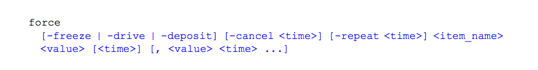
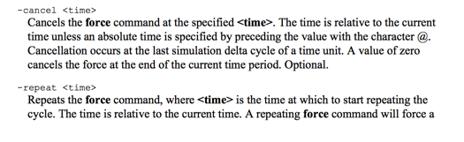
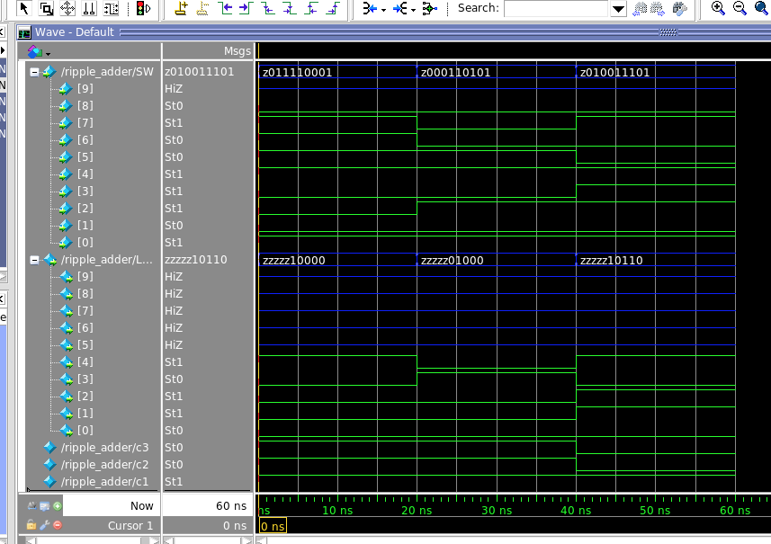

__Case__
+ The case statement compares an expression to a series of cases and executes the statement or statement group associated with the first matching case:


```verilog
case ()
< case1 > : < statement >
< case2 > : < statement >
default : < statement >
endcase
```


`FORCE`






Part I: 7to1 mux


Part II: Ripple adder




Part III: Alu


