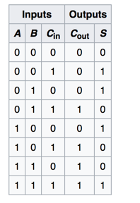

+ The output of combinational circuit at any instant of time, depends only on the levels present at input terminals.

+ The combinational circuit do not use any memory. The previous state of input does not have any effect on the present state of the circuit.

Half Adder
+ The half adder adds two single binary digits A and B. It has two outputs, sum (S) and carry (C). The carry signal represents an overflow into the next digit of a multi-digit addition.

Full Adder
+ A full adder adds binary numbers and accounts for values carried in as well as out. A one-bit full adder adds three one-bit numbers, often written as A, B, and Cin;

 

Ripple Adder
+ It is possible to create a logical circuit using multiple full adders to add N-bit numbers. Each full adder inputs a Cin, which is the Cout of the previous adder. This kind of adder is called a ripple-carry adder, since each carry bit "ripples" to the next full adder.

Signedness
+ is a property of data types representing numbers in computer programs.
+ A numeric variable is
  + signed if it can represent both positive and negative numbers, and
  + unsigned if it can only represent non-negative numbers (zero or positive numbers).

Two's Complement
+ In two's complement notation, a non-negative number is represented by its ordinary binary representation; in this case, the most significant bit is 0. Though, the range of numbers represented is not the same as with unsigned binary numbers. For example, an 8-bit unsigned number can represent the values 0 to 255 (11111111). However a two's complement 8-bit number can only represent positive integers from 0 to 127 (01111111), because the rest of the bit combinations with the most significant bit as '1' represent the negative integers −1 to −128.
