# Review

## Transistor

+ battery, `-` has surplus of electrons
+ _semiconductor_
  + electron flow freely if there is free valence electrons
  + 4 valence electron, which bond with neighboring atom to form a lattice
    + week conductance
  + _doping_
    + introducing impurities to increase conductivity
    + _n-type_: adding group 15 element, with 5 e- (i.e. phosphorus)
      + electron carriers
    + _p-type_: adding group 13 element, with 3 e- (i.e. boron)
      + holes carriers
+ _p-n junctions_
  + 
  + _diffusion_
    + _electrons move from _n-type_ material to _p-type_ material,  creating a particle-free _depletion layer_ (non-conducting)
  + _drift_
    + electric field causing electron to flow back to n section
    + _electric field_
      + opposes the electron movement.
      + direction of electric field is direction of movement on a positive test charge.
    + n-type loses electron, creates positive charge. p-type material gains electron, creates negative charge. field points from n-type (+) to p-type (-)
  + _forward bias_
    + 
    + _+ voltage_ applied to p end of junction. electron injected to n-type section.
    + narrows depletion layer, increase conductance.
  + _reverse bias_
    + 
    + _+ voltage_ applied to n end of junction.
    + depletion layer widens, increase resistance.
    + become a short-circuit.
+ _transistor_
  + _Metal Oxide Semiconductor Field Effect Transistor (MOSFET)_
    + oxide layer: insulator
    + metal layer (gates): electric charge applied to
      + causing current to flow through
    + substrate of n-type material
    + no current pass through because p section in between creates at least one reverse-biased pn junction
  + _nMOS vs pMOS_
    + 
    + _nMOS_
      + when voltage (5V) applied to gate, positive charge built up in metal layer, attracts layer of electron to surface of p-type material.
      + n-type channel: connects drain and source
    + _pMOS_
      + when voltage is logic zero, conduct electricity
  + _gates_
    + 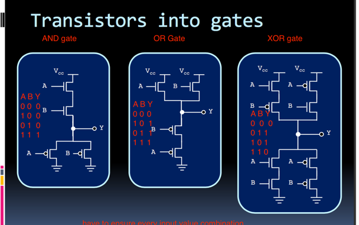

---

## Circuits

+ _standard truth table format_
  + _minterms_ `m_x`
    + 
    + AND expression of all input (in true or complemented form) in functions, for every row in truth table.
      + i.e. `m_0 = ~A & ~B & ~C` and `m7 = A & B & C`
      + i.e. `m_15 = 1111`
      + `n` inputs gives `2^n` minterms/maxterms
    + _SUM-of-Minterms (SOM)_: each minterm corresponds to a single high output in truth table, the combined high outputs are union of these minterms.
  + _maxterms_ `M_x`
    + OR express with all input in functions for each row of truth table where output is 0
      + i.e. `M_0 = A+B+C` has output of 0 for first row of truth table
      + i.e. `m7 = ~A + ~B + ~C`
    + _Product-of-Maxterms (POM)_
      + Since each maxterm only produces a single low output in the truth table, the combined low outputs are intersection of maxterm expressions
  + relationship
    + `m_x = M_x'`
      + minterm `x` is complement of maxterm `x`
      + i.e. `m_0 = ~A ~B = ~(A + B) = M_0`
    + i.e. xor gate
      + `F = m_1 + m_2`
      + `F = M_0 * M_3`
      + `F'' = (m_0 + m_3)' = M_0 * M_3 = F`
+ _gate reduction_
  + _NAND_
    + 
  + rule
    + `Y = ~A * B + A * B = B`
+ _karnaugh maps_
  + 
  + 2D of minterms, where adjacent minterm differ by a single literal ( could be maxterms, and involves grouping of zero entries together)
  + _rule_
    + draw rectangular box, with power of 2 number of cells with value of 1.
    + Create boolean expression

## Devices / Combinational circits
+ _mux_
  + 
  + `M = Y * S + X * ~S`
  + 
+ _decoder_
  + translate from output of one to input of another
+ _half adder_
  + 
  + `C = XY` and `S = X^Y`
+ _full adder_
  + 
  + `C = XY + XZ + YZ` and `S = X^Y^Z`
+ _ripple-carry adder_
  + 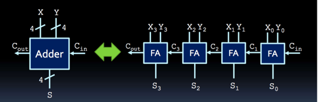
  + chained full adders.
  + `assign {cout, sum} = a+b+cin`
+ _subtractor_
  + 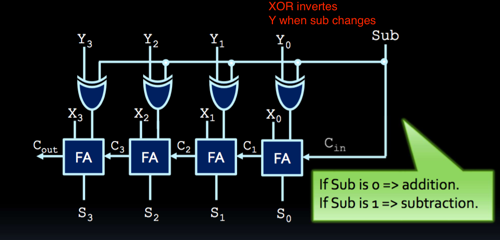
  + _signed numbers_
    + _1's complement_
      + negate each bit
    + _2's complement_
      + negate each bit + 1
    + rules
      + largest positive is 0 followd by all 1;
      + -1 has 1 in all digits
      + most negative binary number is 1 followed by all 0;
      + `2^{n-1}` negative; `2^{n-1}-1` positive.
+ _comparator_
  + 
  + 
  + 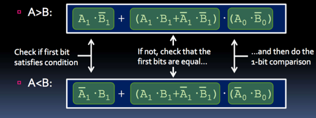

## Sequential Circuits

+ _gate/propagation delay_  
  + length of tie takes for input change to result in corresponding output change.
+ _feedback_
  + _NAND_
    + 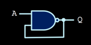
    + 
    + 
  + _NOR_
    + 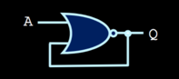
    + 
  + outputs enter _unsteady state_
+ _latches_
  + 
  + More steady behaviour than feedbacks
  + _NAND ~S~R latch_
    + 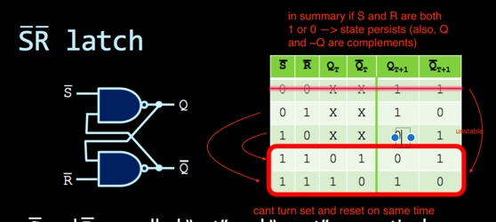
    + input of 11 maintains previous output state
    + circuit remembers signal when going from 01 or 10 to 11 (off)
    + note  
      + `~S = 0 or S = 1 => Q = 1`
      + `~R = 0 or R = 1 => Q = 0`
  + _NOR SR Latch_
    + 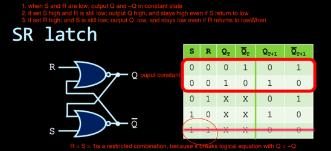
    + circuit remembers signal when going from 01 or 10 to 00 (off)
    + 
  + _instability_
    + when _~S~R latch_ go from 00 to 11, or _SR latch_ go from 11 to 00 (i.e. initial `S = R = 1`, everything active), outcome depends on which signal changes first
    + Hence 00 is forbidden state in NAND _~S~R latch_  and 11 is forbidden in NOR _SR latch_ (i.e. when S and R are both high)
    + because `Q neq ~Q` in these cases according to truth table
+ _clocked/gated SR latch_
   + 
   + 
   + Same as adding a layer of AND gates to NOR SR latch. (yields 4 NAND)
   + In essence, S and R signal affect circuit when C is high.
+ _D latch_
  + 
  + 
  + making R and S depend on a single D, avoids _indeterminate state problem_ where (`R = S = 1`)
  + _latch timing issues_:
    + 
    + when output connect back to input via combinational circuit, when clock is high, output keeps toggling back and forth
    + _transparency_: any change to input are visible to output as long as clock is 1
    + hence output of latch should not be applied directly or through combinational logic to input of latches
+ _SR master-slave flip-flop_
  +        
    + note how slave changes during falling edges (since clock signal is inverted)
  + _opaque_: have output change only once when clock pulse changes
  + _flip-flop_: a latched circuit whose output is triggered with rising edge or falling edge of clock
+ _D flip-flop_
  + 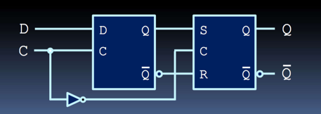
    + _negedge D flip-flop_
  + 
    + _posedge D flip-flop_
  + Connects D latch to input of SR latch to prevent indeterminate state problem with SR
  + behaviour
    + clock = 1:
      + input to first flip-flop sent to second
      + second flip-flop does not change until clock goes down again
      + if input to D changes, the change isnt transmitted to second flip-flop until clock goes high again
+ 
+ _T flip-flop_
  + 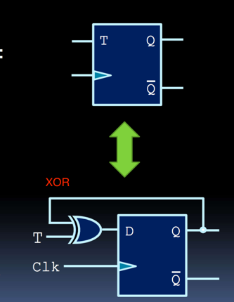
    + inverts Q if T is 1. Q stays same if T is 0
  + 
+ _JK flip-flop_
  + 

## FSM

+ flip-flop timing
  + setup time: input be stable for some time before clock edge
  + hold time: input be stable for some time after clock edge
+ _max clock freq_
  + time period between 2 active clock edge cannot be shorter than longest propagation delay between any two flip-flops + setup time of flip-flops
+ _resetting inputs_
  + sync reset: reset on active edge of clock
  + async reset: reset immediately
+ _register_
  + A series of D flip-flops can store multi-bit value
  + _shift register_
    + 
  + _load register_: parallel load  
    + 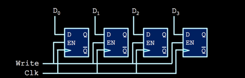
    + 
+ _counter_
  + A series of T flip-flops can increment.
  + _4 bit ripple counter_
    + 
  + _synchronous counter_
    + 
  + _counter with parallel load/clear_
    + 
+ _fsm_
  + definition
    + finite set of states
    + input value trigger transition between states
  + steps
    + state diagram
    + state table
    + assign flip-flop to each state
      + `# of flip-flop = ceil( lg (# of states) )`
      + 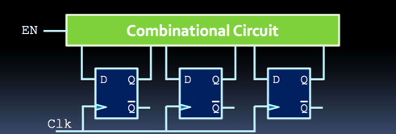
      + _race condition_:
        + more than 1 digits changed in flipflops over one clock cycle, introducing unexpected behavior
        + solution: make assignments such that neighbouring states differ by at most one flip-flop values
    + redraw state table with flip-flop values
    + derive combinational circuit for output and for each flip-flop input
      + _moore machine_: output of fsm depends on current state only
      + _mealy machine_: output of fsm depends on state and input
      + create karnaugh map for each bit of output with given input, determine boolean expression and draw corresponding combination circuits.
